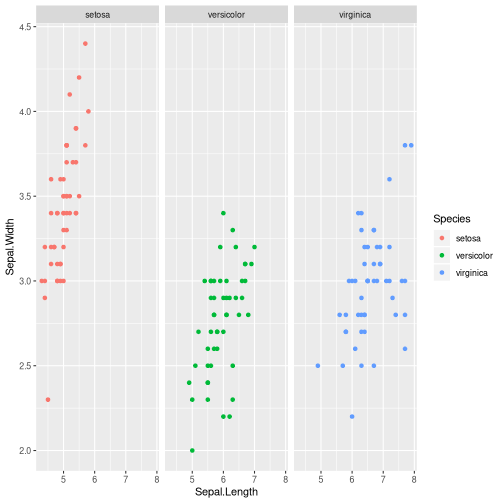

A gramática dos gráficos: uma introdução usando ggplot2
========================================================
author: Diogo Melo
date: 2019/10/29
font-family: 'Helvetica'
width: 1366 
height: 768

Grammar of graphics
======================================================
left: 35%

- Uma gramática define um conjunto de regras para uma linguagem
- Essas regras definem como relacionar elementos para formar sentenças
- A gramática permite criar gráficos utilizando uma sintaxe declarativa


***


Elementos da gramática
======================================================


ggplot2
========================================================
left: 35%

  "ggplot2 is a plotting system for R, based on the grammar of graphics, which tries to take the good parts of base and lattice graphics and none of the bad parts. It takes care of many of the fiddly details that make plotting a hassle (like drawing legends) as well as providing a powerful model of graphics that makes it easy to produce complex multi-layered graphics."
  
***


Data
=====================================================

- Dados a serem plotados;
- Definido pelo argumento __data__;
- No ggplot2, SEMPRE um __data.frame__;
- Cada linha é uma observação;
- Frequentemente é necessario alternar __data.frame__ no formato _narrow_ e _wide_;

Data - formato wide
======================================================


```r
head(iris, 10)
```

```
   Sepal.Length Sepal.Width Petal.Length Petal.Width Species
1           5.1         3.5          1.4         0.2  setosa
2           4.9         3.0          1.4         0.2  setosa
3           4.7         3.2          1.3         0.2  setosa
4           4.6         3.1          1.5         0.2  setosa
5           5.0         3.6          1.4         0.2  setosa
6           5.4         3.9          1.7         0.4  setosa
7           4.6         3.4          1.4         0.3  setosa
8           5.0         3.4          1.5         0.2  setosa
9           4.4         2.9          1.4         0.2  setosa
10          4.9         3.1          1.5         0.1  setosa
```

Data - formato narrow
======================================================


```r
library(tidyr)
head(
  gather(iris, trait, value, Sepal.Length:Petal.Width), 
  10)
```

```
   Species        trait value
1   setosa Sepal.Length   5.1
2   setosa Sepal.Length   4.9
3   setosa Sepal.Length   4.7
4   setosa Sepal.Length   4.6
5   setosa Sepal.Length   5.0
6   setosa Sepal.Length   5.4
7   setosa Sepal.Length   4.6
8   setosa Sepal.Length   5.0
9   setosa Sepal.Length   4.4
10  setosa Sepal.Length   4.9
```

Conversão narrow/wide
====================================================

- Várias opções...
- Vintage:
  - pacotes __reshape__, __reshape2__
    - Funções __melt()__ (wide -> narrow) , __cast()__ (narrow -> wide)
- Moderno:
  - pacote __tidyr__
  - Funções:
    - __gather()__, __pivot_longer()__ (wide -> narrow)
    - __spread()__, __pivot_wider()__ (narrow -> wide)

Aesthetics
=====================================================

- Relações entre aspectos gráficos e variáveis;
- Definido pela função __aes()__
- Na __aes()__, esses aspectos devem ser defindos pelos dados (por uma coluna do data.frame)
- Define: 
  - Eixos x e y;
  - Agrupamentos;
  - Cores;
  - Animações...

Geometries
=====================================================

- Forma de representar os dados;
- Definido pelas funções __geom_*__:
  - Linhas (__geom_lines()__, __geom_segment()__)
  - Pontos (__geom_points()__, __geom_jitter()__)
  - Densidade (__geom_density()__, __geom_raster()__, __geom_hex()__, __geom_density_ridges()__)
  - Histograma (__geom_histogram()__)
  - Boxplot (__geom_boxplot()__, __geom_violin()__)
  - E grande elenco...

ggplot mínimo
=======================================================

Regra geral:


```r
ggplot(data_frame_entrada, aes(x = coluna_eixo_x, 
                               y = coluna_eixo_y,
                               group = coluna_agrupadora, 
                               color = coluna_das_cores)) 
+ geom_tipo_do_grafico(opcoes que não dependem dos dados, 
                       aes(opcoes que dependem))
```

Scatter plot
===================================================

```r
ggplot(data = iris, aes(Sepal.Length, Sepal.Width)) + geom_point()
```


Scatter plot - Species mapeado nas cores
===================================================

```r
ggplot(data = iris, aes(Sepal.Length, Sepal.Width, 
                        color = Species)) + 
  geom_point()
```


Histograma
===================================================


```r
ggplot(diamonds, aes(price)) + geom_histogram(bins = 500)
```


Facets
====================================================

- Criar mais de um gráfico independente;
- Separa dados em sub-gráficos a partir de uma variável categórica;
- Geralmente dado por uma formula, pode ser uma ou mais variáveis:
 - Uma variável: __facet_wrap()__
 - Duas ou mais variáveis: __facet_grid()__
 
Facets
===================================================


```r
ggplot(data = iris, aes(Sepal.Length, Sepal.Width, 
                        color = Species)) + 
  geom_point() + facet_wrap(~Species)
```



Statistics
====================================================

- Elemento derivado dos dados brutos;
- No geral são embutidos em algum geom_
- Resumos usando estatísticas: __geom_boxplor()__
- Funções de tendencia: __geom_smooth()__
- Reta de regressão: __geom_smooth(method="lm")__

Statistics - regressão não-linear (loess)
====================================================


```r
ggplot(data = iris, aes(Sepal.Length, Sepal.Width, 
                        color = Species)) + 
  geom_point() + geom_smooth()
```


Statistics - regressão linear (lm)
====================================================


```r
ggplot(data = iris, aes(Sepal.Length, Sepal.Width, 
                        color = Species)) + 
  geom_point() + geom_smooth(method = "lm")
```


Statistics - boxplot + jitter
====================================================


```r
library(tidyr)
narrow_iris = pivot_longer(iris, -Species)
ggplot(narrow_iris, aes(Species, value)) + 
  geom_boxplot() + geom_jitter(width = 0.2, height = 0) + facet_wrap(~name, scales="free")
```


Statistics - boxplot + dotplot
====================================================


```r
library(tidyr)
narrow_iris = pivot_longer(iris, -Species)
ggplot(narrow_iris, aes(Species, value)) + 
  geom_boxplot() + geom_dotplot(binaxis = 'y',
        dotsize = 0.5,
        stackdir = 'center') + facet_wrap(~name, scales="free")
```


Coordinates
====================================================

- Mudanças nos eixos e escalas (cor, forma, tamanho...)
- Definido pelas funções scale_
- Eixos: __scale_y_continous()__, __scale_x_discrete()__, ... 
- Escalas de cor: scale\_color\_* (__scale_color_continuous__, scale_color_discrete__)


Theme
====================================================

- Tudo que não tem nada a ver com os dados
  - Fontes;
  - Tamanhos;
  - Fundo;
  - Posição de legendas e texto;
  
- Definido pela função theme()
- Ou usando temas prontos!
  - Tem vários, é ótimo!


ggplot - objetos graficos
=======================================================

- No ggplot os objetos gráficos podem ser manipulados ou armazenados, diferente dos plots padrão onde os gráficos são "efeitos colaterais"

- Isso significa que vc pode alterar gráficos já feitos usando "+"


```r
meu_grafico = ggplot(gapminder, aes(x = log(gdpPercap), 
                      y = log(lifeExp))) + geom_point(aes(color = continent))
```

ggplot - objetos graficos
=======================================================
left: 60%

Algumas opções comuns:


```r
meu_grafico = meu_grafico + 
    labs(x = "GDP per capta", 
         y = "Expectativa de vida")

meu_grafico = meu_grafico + 
  theme(text = element_text(size = 30), 
    legend.title = 
        element_text(face = "italic")) +
  scale_color_discrete(name = "Continente")
```

***


```r
meu_grafico
```


ggplot - temas
=======================================================
left: 30%

Temas prontos!


```r
meu_grafico = meu_grafico + theme_bw()
```

***


```r
meu_grafico
```


ggplot - temas
=======================================================

Temas prontos!


```r
library(ggthemes)
meu_grafico = ggplot(gapminder, 
 aes(x = log(gdpPercap), 
     y = log(lifeExp))) + 
  geom_point(size = 3, 
  aes(shape = continent)) + 
  theme_wsj()
```

***


```r
meu_grafico
```


ggplot - outros tipos de gráficos
=======================================================

Documentação

- http://docs.ggplot2.org/current/
- How to format plots for publication using ggplot2 - http://www.noamross.net/blog/2013/11/20/formatting-plots-for-pubs.html 
- http://stackoverflow.com/
