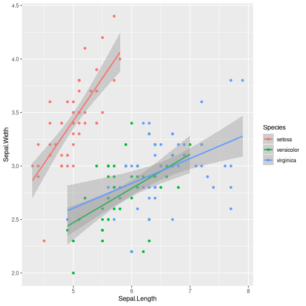
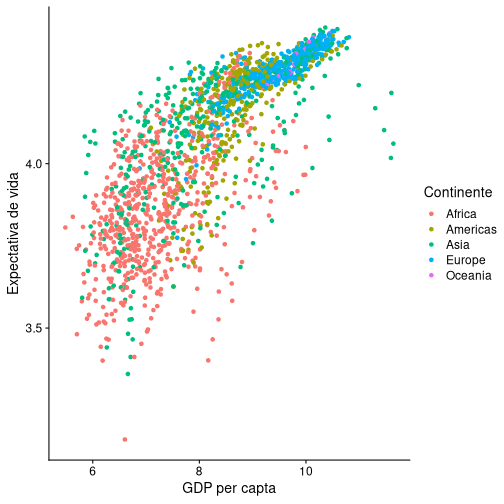

A gramática dos gráficos: uma introdução usando ggplot2
========================================================
author: Diogo Melo
date: 2019/10/29
font-family: 'Helvetica'
width: 1366 
height: 768

Grammar of graphics
======================================================
left: 35%

- Uma gramática define um conjunto de regras para uma linguagem. 
- Essas regras definem como relacionar elementos para formar sentenças. 
- A gramática permite criar gráficos utilizando uma sintaxe declarativa.


***


Elementos da gramática
======================================================


ggplot2
========================================================
left: 35%

  "ggplot2 is a plotting system for R, based on the grammar of graphics, which tries to take the good parts of base and lattice graphics and none of the bad parts. It takes care of many of the fiddly details that make plotting a hassle (like drawing legends) as well as providing a powerful model of graphics that makes it easy to produce complex multi-layered graphics."
  
***


Data
=====================================================

- Dados a serem plotados;
- Definido pelo argumento __data__
- No caso do ggplot2, SEMPRE um __data.frame__;
- Cada linha é uma observação;
- Geralmente é melhor usar data.frames no formato "narrow";
- Cores, grupos, separações em paineis são todas definidas por fatores (yay!!)

Data - formato wide
======================================================


```r
head(iris, 10)
```

```
   Sepal.Length Sepal.Width Petal.Length Petal.Width Species
1           5.1         3.5          1.4         0.2  setosa
2           4.9         3.0          1.4         0.2  setosa
3           4.7         3.2          1.3         0.2  setosa
4           4.6         3.1          1.5         0.2  setosa
5           5.0         3.6          1.4         0.2  setosa
6           5.4         3.9          1.7         0.4  setosa
7           4.6         3.4          1.4         0.3  setosa
8           5.0         3.4          1.5         0.2  setosa
9           4.4         2.9          1.4         0.2  setosa
10          4.9         3.1          1.5         0.1  setosa
```

Data - formato narrow
======================================================


```r
library(tidyr)
head(
  gather(iris, trait, value, Sepal.Length:Petal.Width), 
  10)
```

```
   Species        trait value
1   setosa Sepal.Length   5.1
2   setosa Sepal.Length   4.9
3   setosa Sepal.Length   4.7
4   setosa Sepal.Length   4.6
5   setosa Sepal.Length   5.0
6   setosa Sepal.Length   5.4
7   setosa Sepal.Length   4.6
8   setosa Sepal.Length   5.0
9   setosa Sepal.Length   4.4
10  setosa Sepal.Length   4.9
```

Aesthetics
=====================================================

- Relações entre aspectos gráficos e variáveis;
- Definido pela função __aes()__
- Na __aes()__, esses aspectos devem ser defindos pelos dados (por uma coluna do data.frame)
- Define: 
  - Eixos x e y;
  - Agrupamentos;
  - Cores;
  - animação...

Geometries
=====================================================

- Forma de representar os gráficos;
  - Linhas
  - Pontos
  - Densidade
  - Histograma
  - Boxplot
  - ...

ggplot mínimo
=======================================================

Regra geral:


```r
ggplot(data_frame_entrada, aes(x = coluna_eixo_x, 
                               y = coluna_eixo_y,
                               group = coluna_agrupadora, 
                               color = coluna_das_cores)) 
+ geom_tipo_do_grafico(opcoes que não dependem dos dados, 
                       aes(opcoes que dependem))
```

Scatter plot
===================================================

```r
ggplot(data = iris, aes(Sepal.Length, Sepal.Width)) + geom_point()
```


Facets
====================================================

Statistics
====================================================

Coordinates
====================================================

Theme
====================================================


ggplot - mudando cores
=======================================================


```r
ggplot(gapminder, aes(x = log(gdpPercap), 
                      y = log(lifeExp),
                      group = country, 
                      color = year)) + geom_point()
```


```r
ggplot(gapminder, aes(x = log(gdpPercap), 
                      y = log(lifeExp),
                      group = country, 
                      color = continent)) + geom_point()
```

ggplot - mudando cores
=======================================================


***


ggplot - objetos graficos
=======================================================

- No ggplot os objetos gráficos podem ser manipulados ou armazenados, diferente dos plots padrão onde os gráficos são "efeitos colaterais"

- Isso significa que vc pode alterar gráficos já feitos usando "+"


```r
meu_grafico = ggplot(gapminder, aes(x = log(gdpPercap), 
                      y = log(lifeExp))) + geom_point(aes(color = continent))
```

ggplot - objetos graficos
=======================================================
left: 60%

Algumas opções comuns:


```r
meu_grafico = meu_grafico + 
    labs(x = "GDP per capta", 
         y = "Expectativa de vida")

meu_grafico = meu_grafico + 
  theme(text = element_text(size = 30), 
    legend.title = 
        element_text(face = "italic")) +
  scale_color_discrete(name = "Continente")
```

***


```r
meu_grafico
```



ggplot - temas
=======================================================
left: 30%

Temas prontos!


```r
meu_grafico = meu_grafico + theme_bw()
```

***


```r
meu_grafico
```


ggplot - temas
=======================================================

Temas prontos!


```r
library(ggthemes)
meu_grafico = ggplot(gapminder, 
 aes(x = log(gdpPercap), 
     y = log(lifeExp))) + 
  geom_point(size = 3, 
  aes(shape = continent)) + 
  theme_wsj()
```

***


```r
meu_grafico
```


ggplot - outros tipos de gráficos
=======================================================

 - regressão linear 


```r
meu_grafico = ggplot(gapminder,  aes(x = log(gdpPercap), y = log(lifeExp))) + geom_point(aes(color = continent))
```

***
 

```r
meu_grafico + geom_smooth(method = "lm") 
```


ggplot - outros tipos de gráficos
=======================================================

 - regressão linear por continente


```r
meu_grafico = ggplot(gapminder,  aes(x = log(gdpPercap), y = log(lifeExp))) + geom_point(aes(color = continent))
```

***
 

```r
meu_grafico + geom_smooth(method = "lm", aes(color = continent)) 
```



ggplot - outros tipos de gráficos
=======================================================

 - boxplot


```r
meu_grafico = ggplot(gapminder, 
  aes(year, lifeExp, 
  group = interaction(year, 
                continent), 
  color = continent)) 
```

***
 

```r
meu_grafico + geom_boxplot()
```


ggplot - combinando tipos de gráficos
=======================================================

 - boxplot


```r
meu_grafico = ggplot(gapminder, 
  aes(year, lifeExp, 
  group = interaction(year, 
                continent), 
  color = continent)) 
```

***
 

```r
meu_grafico + geom_boxplot() + geom_smooth(method = "lm", aes(group = continent)) + theme_classic()
```


ggplot - outros tipos de gráficos
=======================================================


```r
geom_histogram()
geom_jitter()
geom_text(aes(label = coluna_texto))
geom_violin()
geom_errorbar(aes(ymax, ymin))
...
```

ggplot - outros tipos de gráficos
=======================================================

Documentação

- http://docs.ggplot2.org/current/
- How to format plots for publication using ggplot2 - http://www.noamross.net/blog/2013/11/20/formatting-plots-for-pubs.html 
- http://stackoverflow.com/
