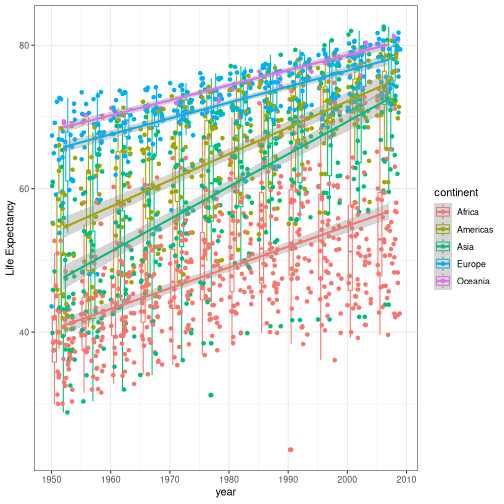
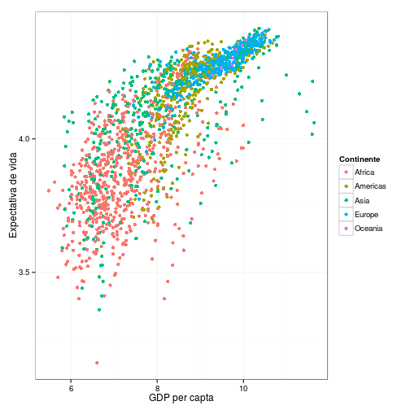
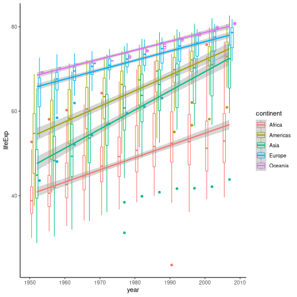

plyr & ggplot2
========================================================
author: Diogo Melo
date: 2015/04/30
font-family: 'Helvetica'
width: 1366 
height: 768

plyr
========================================================

Plyr é um conjunto de funções que substituem a familia apply.

Queremos aplicar uma mesma função em subconjuntos

- Mais flexivel 
- Fácil de paralelizar
- Com algumas facilidades importantes

***


 
Syntaxe geral
========================================================


```r
__ply()
```

Primeira letra indica o tipo da entrada:


```r
a_ply(), d_ply(), l_ply()
```

Segunda letra indica o tipo da saída:


```r
_aply(), _dply(), _lply()
```

 - (a)rray
 - (l)ist
 - (d)ata.frame

l_ply
========================================================

  Listas tem divisão natural, então basta identificar o objeto de entrada e a função
  

```r
library(plyr)
simple_list <- list('zero' = rnorm(5), 
                    'cinco' = rnorm(5, 5), 
                    'dez' = rnorm(5, 10))
print(simple_list)
```

```
$zero
[1]  0.370976067  0.946874433  1.137400307  0.007510545 -0.246431898

$cinco
[1] 4.153868 5.812100 5.197216 4.708775 4.712682

$dez
[1] 10.08417 10.82555 10.18764 11.50417 10.17117
```

l_ply
========================================================

  Listas tem divisão natural, então basta identificar o objeto de entrada e a função


```r
llply(simple_list, sum)
```

```
$zero
[1] 2.216329

$cinco
[1] 24.58464

$dez
[1] 52.7727
```

```r
#identico a:
lapply(simple_list, sum)
```

l_ply
========================================================

  Podemos também mudar o tipo da saida (diferente do lapply())


```r
laply(simple_list, mean)
```

```
[1]  0.4432659  4.9169281 10.5545408
```

```r
ldply(simple_list, quantile)
```

```
    .id         0%          25%        50%        75%     100%
1  zero -0.2464319  0.007510545  0.3709761  0.9468744  1.13740
2 cinco  4.1538680  4.708774862  4.7126818  5.1972161  5.81210
3   dez 10.0841663 10.171172746 10.1876439 10.8255485 11.50417
```

l_ply
========================================================

  Bom para conversões


```r
laply(simple_list, identity)
```

```
              1          2         3            4          5
[1,]  0.3709761  0.9468744  1.137400  0.007510545 -0.2464319
[2,]  4.1538680  5.8120997  5.197216  4.708774862  4.7126818
[3,] 10.0841663 10.8255485 10.187644 11.504172412 10.1711727
```


```r
ldply(simple_list, identity)
```

```
    .id         V1         V2        V3           V4         V5
1  zero  0.3709761  0.9468744  1.137400  0.007510545 -0.2464319
2 cinco  4.1538680  5.8120997  5.197216  4.708774862  4.7126818
3   dez 10.0841663 10.8255485 10.187644 11.504172412 10.1711727
```

a_ply
========================================================

  Arrays não tem divisão natural, então um segundo argumento é necessario para
  indicar o sentido da operação sendo feita
  

```r
str(iris3)
```

```
 num [1:50, 1:4, 1:3] 5.1 4.9 4.7 4.6 5 5.4 4.6 5 4.4 4.9 ...
 - attr(*, "dimnames")=List of 3
  ..$ : NULL
  ..$ : chr [1:4] "Sepal L." "Sepal W." "Petal L." "Petal W."
  ..$ : chr [1:3] "Setosa" "Versicolor" "Virginica"
```

```r
aaply(iris3, 3, colMeans)
```

```
            
X1           Sepal L. Sepal W. Petal L. Petal W.
  Setosa        5.006    3.428    1.462    0.246
  Versicolor    5.936    2.770    4.260    1.326
  Virginica     6.588    2.974    5.552    2.026
```

Levemente diferente do apply.


```r
apply(iris3, 3, colMeans)
```

```
         Setosa Versicolor Virginica
Sepal L.  5.006      5.936     6.588
Sepal W.  3.428      2.770     2.974
Petal L.  1.462      4.260     5.552
Petal W.  0.246      1.326     2.026
```

a_ply
========================================================


```r
aaply(iris3, 3, colMeans)
```

```
            
X1           Sepal L. Sepal W. Petal L. Petal W.
  Setosa        5.006    3.428    1.462    0.246
  Versicolor    5.936    2.770    4.260    1.326
  Virginica     6.588    2.974    5.552    2.026
```

Ou...


```r
aaply(iris3, c(2, 3), mean)
```

```
          X2
X1         Setosa Versicolor Virginica
  Sepal L.  5.006      5.936     6.588
  Sepal W.  3.428      2.770     2.974
  Petal L.  1.462      4.260     5.552
  Petal W.  0.246      1.326     2.026
```

a_ply
========================================================

Novamente podemos mudar a saída

 - data.frame:
 

```r
adply(iris3, 3, colMeans, .id = 'Species')
```

```
     Species Sepal L. Sepal W. Petal L. Petal W.
1     Setosa    5.006    3.428    1.462    0.246
2 Versicolor    5.936    2.770    4.260    1.326
3  Virginica    6.588    2.974    5.552    2.026
```

a_ply
========================================================

Novamente podemos mudar a saída

- list: 


```r
alply(iris3, 3, colMeans, .dims = TRUE)
```

```
$Setosa
Sepal L. Sepal W. Petal L. Petal W. 
   5.006    3.428    1.462    0.246 

$Versicolor
Sepal L. Sepal W. Petal L. Petal W. 
   5.936    2.770    4.260    1.326 

$Virginica
Sepal L. Sepal W. Petal L. Petal W. 
   6.588    2.974    5.552    2.026 

attr(,"split_type")
[1] "array"
attr(,"split_labels")
          X1
1     Setosa
2 Versicolor
3  Virginica
```

a_ply
========================================================

O a_ply() tb é útil para converter arrays:

 - data.frames


```r
iris_df = adply(iris3, 3, .id = 'Species')
head(iris_df)
```

```
  Species Sepal L. Sepal W. Petal L. Petal W.
1  Setosa      5.1      3.5      1.4      0.2
2  Setosa      4.9      3.0      1.4      0.2
3  Setosa      4.7      3.2      1.3      0.2
4  Setosa      4.6      3.1      1.5      0.2
5  Setosa      5.0      3.6      1.4      0.2
6  Setosa      5.4      3.9      1.7      0.4
```

a_ply
========================================================

O a_ply() tb é útil para converter arrays:

 - listas


```r
iris_list = alply(iris3, 3, .dims = TRUE)
names(iris_list)
```

```
[1] "Setosa"     "Versicolor" "Virginica" 
```

```r
class(iris_list[[1]])
```

```
[1] "matrix"
```

```r
str(iris_list[[1]])
```

```
 num [1:50, 1:4] 5.1 4.9 4.7 4.6 5 5.4 4.6 5 4.4 4.9 ...
 - attr(*, "dimnames")=List of 2
  ..$ : NULL
  ..$ : chr [1:4] "Sepal L." "Sepal W." "Petal L." "Petal W."
```

d_ply
========================================================

d_ply é a função mais complexa

 - seu uso geralmente envolve o uso de funções auxiliares; 
 - muita da funcionalidade básica é mais simples no dplyr;
 - ainda é útil para operações complicadas, que operam em mais de uma linha simultaneamente.
 - básicamente um aggregate-on-steroids
 
d_ply
========================================================


```r
library(gapminder)
str(gapminder)
```

```
'data.frame':	1704 obs. of  6 variables:
 $ country  : Factor w/ 142 levels "Afghanistan",..: 1 1 1 1 1 1 1 1 1 1 ...
 $ continent: Factor w/ 5 levels "Africa","Americas",..: 3 3 3 3 3 3 3 3 3 3 ...
 $ year     : num  1952 1957 1962 1967 1972 ...
 $ lifeExp  : num  28.8 30.3 32 34 36.1 ...
 $ pop      : num  8425333 9240934 10267083 11537966 13079460 ...
 $ gdpPercap: num  779 821 853 836 740 ...
```
 
d_ply
========================================================

O segundo argumento é um coluna do data.frame que será usada para subdividi-lo


```r
dlply(gapminder, 'country')[[1]]
```

```
       country continent year lifeExp      pop gdpPercap
1  Afghanistan      Asia 1952  28.801  8425333  779.4453
2  Afghanistan      Asia 1957  30.332  9240934  820.8530
3  Afghanistan      Asia 1962  31.997 10267083  853.1007
4  Afghanistan      Asia 1967  34.020 11537966  836.1971
5  Afghanistan      Asia 1972  36.088 13079460  739.9811
6  Afghanistan      Asia 1977  38.438 14880372  786.1134
7  Afghanistan      Asia 1982  39.854 12881816  978.0114
8  Afghanistan      Asia 1987  40.822 13867957  852.3959
9  Afghanistan      Asia 1992  41.674 16317921  649.3414
10 Afghanistan      Asia 1997  41.763 22227415  635.3414
11 Afghanistan      Asia 2002  42.129 25268405  726.7341
12 Afghanistan      Asia 2007  43.828 31889923  974.5803
```

d_ply
========================================================

Principal ponto de discórdia: 
  - O data.frame é subdividido de acordo com uma (ou mais) coluna(s) de indicadores, mas os "sub"-data.frames ainda contém essas colunas!


```r
dlply(gapminder, 'country')[[1]]
```

```
       country continent year lifeExp      pop gdpPercap
1  Afghanistan      Asia 1952  28.801  8425333  779.4453
2  Afghanistan      Asia 1957  30.332  9240934  820.8530
3  Afghanistan      Asia 1962  31.997 10267083  853.1007
4  Afghanistan      Asia 1967  34.020 11537966  836.1971
5  Afghanistan      Asia 1972  36.088 13079460  739.9811
6  Afghanistan      Asia 1977  38.438 14880372  786.1134
7  Afghanistan      Asia 1982  39.854 12881816  978.0114
8  Afghanistan      Asia 1987  40.822 13867957  852.3959
9  Afghanistan      Asia 1992  41.674 16317921  649.3414
10 Afghanistan      Asia 1997  41.763 22227415  635.3414
11 Afghanistan      Asia 2002  42.129 25268405  726.7341
12 Afghanistan      Asia 2007  43.828 31889923  974.5803
```

d_ply
========================================================

Isso é um problema quando queremos fazer operações nas colunas numéricas apenas:


```r
head(ddply(gapminder, 'country', mean))
```

```
      country V1
1 Afghanistan NA
2     Albania NA
3     Algeria NA
4      Angola NA
5   Argentina NA
6   Australia NA
```

d_ply
========================================================

Isso é um problema quando queremos fazer operações nas colunas numéricas apenas:


```r
head(ddply(gapminder, 'country', mean))
```

A função numcolwise() resolve esse problema, mas ela é aplicada na função!!


```r
head(ddply(gapminder, .(country), numcolwise(mean)))
```

```
      country   year  lifeExp      pop  gdpPercap
1 Afghanistan 1979.5 37.47883 15823715   802.6746
2     Albania 1979.5 68.43292  2580249  3255.3666
3     Algeria 1979.5 59.03017 19875406  4426.0260
4      Angola 1979.5 37.88350  7309390  3607.1005
5   Argentina 1979.5 69.06042 28602240  8955.5538
6   Australia 1979.5 74.66292 14649312 19980.5956
```


d_ply
========================================================

A função .() permite omitir as aspas e fazer operações nas colunas:


```r
head(ddply(gapminder, .(country, log(year)), numcolwise(mean)), 12)
```

```
       country log(year) lifeExp      pop gdpPercap
1  Afghanistan  7.576610  28.801  8425333  779.4453
2  Afghanistan  7.579168  30.332  9240934  820.8530
3  Afghanistan  7.581720  31.997 10267083  853.1007
4  Afghanistan  7.584265  34.020 11537966  836.1971
5  Afghanistan  7.586804  36.088 13079460  739.9811
6  Afghanistan  7.589336  38.438 14880372  786.1134
7  Afghanistan  7.591862  39.854 12881816  978.0114
8  Afghanistan  7.594381  40.822 13867957  852.3959
9  Afghanistan  7.596894  41.674 16317921  649.3414
10 Afghanistan  7.599401  41.763 22227415  635.3414
11 Afghanistan  7.601902  42.129 25268405  726.7341
12 Afghanistan  7.604396  43.828 31889923  974.5803
```


d_ply
========================================================

Podemos também usar formulas:


```r
head(ddply(gapminder, ~ country + log(year), numcolwise(mean)), 12)
```

```
       country log(year) lifeExp      pop gdpPercap
1  Afghanistan  7.576610  28.801  8425333  779.4453
2  Afghanistan  7.579168  30.332  9240934  820.8530
3  Afghanistan  7.581720  31.997 10267083  853.1007
4  Afghanistan  7.584265  34.020 11537966  836.1971
5  Afghanistan  7.586804  36.088 13079460  739.9811
6  Afghanistan  7.589336  38.438 14880372  786.1134
7  Afghanistan  7.591862  39.854 12881816  978.0114
8  Afghanistan  7.594381  40.822 13867957  852.3959
9  Afghanistan  7.596894  41.674 16317921  649.3414
10 Afghanistan  7.599401  41.763 22227415  635.3414
11 Afghanistan  7.601902  42.129 25268405  726.7341
12 Afghanistan  7.604396  43.828 31889923  974.5803
```

d_ply
========================================================

- Se quisermos operar sobre mais de uma coluna numérica simultaneamente, o numcolwise não serve
- Nesse caso, o melhor é usar uma função que faça a indexação desejada:


```r
l_iris <- dlply(iris, ~ Species, '[', 1:3)
llply(l_iris, cor)[[1]]
```

```
             Sepal.Length Sepal.Width Petal.Length
Sepal.Length    1.0000000   0.7425467    0.2671758
Sepal.Width     0.7425467   1.0000000    0.1777000
Petal.Length    0.2671758   0.1777000    1.0000000
```

d_ply
========================================================

Ou, usando o pipe (%>%) do pacote magrittr


```r
library(magrittr)
dlply(iris, ~ Species, '[', 1:3) %>% llply(., cor)
```

```
$setosa
             Sepal.Length Sepal.Width Petal.Length
Sepal.Length    1.0000000   0.7425467    0.2671758
Sepal.Width     0.7425467   1.0000000    0.1777000
Petal.Length    0.2671758   0.1777000    1.0000000

$versicolor
             Sepal.Length Sepal.Width Petal.Length
Sepal.Length    1.0000000   0.5259107    0.7540490
Sepal.Width     0.5259107   1.0000000    0.5605221
Petal.Length    0.7540490   0.5605221    1.0000000

$virginica
             Sepal.Length Sepal.Width Petal.Length
Sepal.Length    1.0000000   0.4572278    0.8642247
Sepal.Width     0.4572278   1.0000000    0.4010446
Petal.Length    0.8642247   0.4010446    1.0000000
```


plyr + magrittr + evolqg
========================================================


```r
library(evolqg)
data(dentus)
dlply(dentus, ~ species, '[', 1:4) %>% 
  llply(cov) %>% 
  ldply(MeanMatrixStatistics, .id = 'Species')
```

```
  Species MeanSquaredCorrelation      pc1%       ICV respondability
1       A             0.26304221 0.5942705 1.0301592      1.2184202
2       B             0.12459035 0.4659021 0.7065384      1.1001694
3       C             0.15157218 0.4865811 0.7509757      1.1670278
4       D             0.42069839 0.7331679 1.2971322      1.3457091
5       E             0.04036267 0.4049835 0.4711963      0.9445442
  evolvability conditional.evolvability  autonomy flexibility constraints
1    0.9787216                0.4804369 0.5147829   0.7696308   0.7541552
2    0.9793506                0.7177652 0.7338283   0.8795195   0.6413520
3    1.0277034                0.6757720 0.6456454   0.8666331   0.6801044
4    1.0183773                0.4699398 0.5400998   0.7366581   0.8506171
5    0.8972357                0.7999347 0.8913302   0.9480199   0.6200373
```

ggplot2
========================================================
left: 35%

  "ggplot2 is a plotting system for R, based on the grammar of graphics, which tries to take the good parts of base and lattice graphics and none of the bad parts. It takes care of many of the fiddly details that make plotting a hassle (like drawing legends) as well as providing a powerful model of graphics that makes it easy to produce complex multi-layered graphics."
  
***

 

ggplot
=======================================================

Todas os plots no ggplot tem a mesma estrutura e dependem bastante do objeto de entrada:

 - SEMPRE um data.frame;
 - Cada linha é uma observação;
 - Geralmente é melhor usar data.frames no formato "narrow";
 - Cores, grupos, separações em paineis são todas definidas por fatores (yay!!)

ggplot
=======================================================

Regra geral:


```r
ggplot(data_frame_entrada, aes(x = coluna_eixo_x, 
                               y = coluna_eixo_y,
                               group = coluna_agrupadora, 
                               color = coluna_das_cores)) 
+ geom_tipo_do_grafico(opcoes que não dependem dos dados, 
                       aes(opcoes que dependem))
```

ggplot - mudando cores
=======================================================


```r
ggplot(gapminder, aes(x = log(gdpPercap), 
                      y = log(lifeExp),
                      group = country, 
                      color = year)) + geom_point()
```


```r
ggplot(gapminder, aes(x = log(gdpPercap), 
                      y = log(lifeExp),
                      group = country, 
                      color = continent)) + geom_point()
```

ggplot - mudando cores
=======================================================

 

***

 

ggplot - objetos graficos
=======================================================

- No ggplot os objetos gráficos podem ser manipulados ou armazenados, diferente dos plots padrão onde os gráficos são "efeitos colaterais"

- Isso significa que vc pode alterar gráficos já feitos usando "+"


```r
meu_grafico = ggplot(gapminder, aes(x = log(gdpPercap), 
                      y = log(lifeExp))) + geom_point(aes(color = continent))
```

ggplot - objetos graficos
=======================================================
left: 60%

Algumas opções comuns:


```r
meu_grafico = meu_grafico + 
    labs(x = "GDP per capta", 
         y = "Expectativa de vida")

meu_grafico = meu_grafico + 
  theme(text = element_text(size = 30), 
    legend.title = 
        element_text(face = "italic")) +
  scale_color_discrete(name = "Continente")
```

***


```r
meu_grafico
```

 

ggplot - temas
=======================================================
left: 30%

Temas prontos!


```r
meu_grafico = meu_grafico + theme_bw()
```

***


```r
meu_grafico
```

 

ggplot - temas
=======================================================

Temas prontos!


```r
library(ggthemes)
meu_grafico = ggplot(gapminder, 
 aes(x = log(gdpPercap), 
     y = log(lifeExp))) + 
  geom_point(size = 3, 
  aes(shape = continent)) + 
  theme_wsj()
```

***


```r
meu_grafico
```

 

ggplot - outros tipos de gráficos
=======================================================

 - regressão linear 


```r
meu_grafico = ggplot(gapminder,  aes(x = log(gdpPercap), y = log(lifeExp))) + geom_point(aes(color = continent))
```

***
 

```r
meu_grafico + geom_smooth(method = "lm") 
```

 

ggplot - outros tipos de gráficos
=======================================================

 - regressão linear por continente


```r
meu_grafico = ggplot(gapminder,  aes(x = log(gdpPercap), y = log(lifeExp))) + geom_point(aes(color = continent))
```

***
 

```r
meu_grafico + geom_smooth(method = "lm", aes(color = continent)) 
```

 

ggplot - outros tipos de gráficos
=======================================================

 - boxplot


```r
meu_grafico = ggplot(gapminder, 
  aes(year, lifeExp, 
  group = interaction(year, 
                continent), 
  color = continent)) 
```

***
 

```r
meu_grafico + geom_boxplot()
```

 

ggplot - combinando tipos de gráficos
=======================================================

 - boxplot


```r
meu_grafico = ggplot(gapminder, 
  aes(year, lifeExp, 
  group = interaction(year, 
                continent), 
  color = continent)) 
```

***
 

```r
meu_grafico + geom_boxplot() + geom_smooth(method = "lm", aes(group = continent)) + theme_classic()
```

 

ggplot - outros tipos de gráficos
=======================================================


```r
geom_histogram()
geom_jitter()
geom_text(aes(label = coluna_texto))
geom_violin()
...
```
