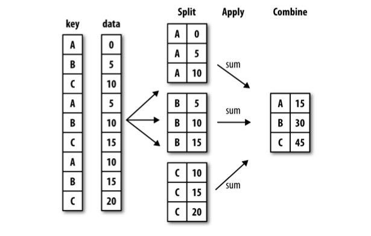

plyr & ggplot2
========================================================
author: Diogo Melo
date: 2015/04/30
font-family: 'Helvetica'
width: 1440
height: 900

plyr
========================================================

Plyr é um conjunto de funções que substituem a familia apply.

Queremos aplicar uma mesma função em subconjuntos

- Mais flexivel 
- Fácil de paralelizar
- Com algumas facilidades importantes

***

 
Syntaxe geral
========================================================


```r
__ply()
```

Primeira letra indica o tipo da entrada:


```r
a_ply(), d_ply(), l_ply()
```

Segunda letra indica o tipo da saída:


```r
_aply(), _dply(), _lply()
```

 - (a)rray
 - (l)ist
 - (d)ata.frame

l_ply
========================================================

  Listas tem divisão natural, então basta identificar o objeto de entrada e a função
  

```r
library(plyr)
simple_list <- list('zero' = rnorm(5), 
                    'cinco' = rnorm(5, 5), 
                    'dez' = rnorm(5, 10))
print(simple_list)
```

```
$zero
[1]  0.6250904 -0.8661789 -0.2648632 -0.1133162  0.6947531

$cinco
[1] 3.591352 4.261204 5.514288 6.586159 5.493709

$dez
[1]  8.699961 10.995110 10.092969 10.428889 11.246478
```

l_ply
========================================================

  Listas tem divisão natural, então basta identificar o objeto de entrada e a função


```r
llply(simple_list, sum)
```

```
$zero
[1] 0.07548509

$cinco
[1] 25.44671

$dez
[1] 51.46341
```

```r
#identico a:
lapply(simple_list, sum)
```

l_ply
========================================================

  Podemos também mudar o tipo da saida (diferente do lapply())


```r
laply(simple_list, mean)
```

```
[1]  0.01509702  5.08934254 10.29268141
```

```r
#identico a:
ldply(simple_list, quantile)
```

```
    .id         0%        25%        50%        75%       100%
1  zero -0.8661789 -0.2648632 -0.1133162  0.6250904  0.6947531
2 cinco  3.5913520  4.2612042  5.4937094  5.5142877  6.5861594
3   dez  8.6999611 10.0929687 10.4288885 10.9951104 11.2464783
```

l_ply
========================================================

  Bom para conversões


```r
laply(simple_list, identity)
```

```
             1          2          3          4          5
[1,] 0.6250904 -0.8661789 -0.2648632 -0.1133162  0.6947531
[2,] 3.5913520  4.2612042  5.5142877  6.5861594  5.4937094
[3,] 8.6999611 10.9951104 10.0929687 10.4288885 11.2464783
```


```r
ldply(simple_list, identity)
```

```
    .id        V1         V2         V3         V4         V5
1  zero 0.6250904 -0.8661789 -0.2648632 -0.1133162  0.6947531
2 cinco 3.5913520  4.2612042  5.5142877  6.5861594  5.4937094
3   dez 8.6999611 10.9951104 10.0929687 10.4288885 11.2464783
```

a_ply
========================================================

  Arrays não tem divisão natural, então um segundo argumento é necessario para
  indicar o sentido da operação sendo feita
  

```r
str(iris3)
```

```
 num [1:50, 1:4, 1:3] 5.1 4.9 4.7 4.6 5 5.4 4.6 5 4.4 4.9 ...
 - attr(*, "dimnames")=List of 3
  ..$ : NULL
  ..$ : chr [1:4] "Sepal L." "Sepal W." "Petal L." "Petal W."
  ..$ : chr [1:3] "Setosa" "Versicolor" "Virginica"
```

```r
aaply(iris3, 3, colMeans)
```

```
            
X1           Sepal L. Sepal W. Petal L. Petal W.
  Setosa        5.006    3.428    1.462    0.246
  Versicolor    5.936    2.770    4.260    1.326
  Virginica     6.588    2.974    5.552    2.026
```

Levemente diferente do apply.


```r
apply(iris3, 3, colMeans)
```

```
         Setosa Versicolor Virginica
Sepal L.  5.006      5.936     6.588
Sepal W.  3.428      2.770     2.974
Petal L.  1.462      4.260     5.552
Petal W.  0.246      1.326     2.026
```

a_ply
========================================================


```r
aaply(iris3, 3, colMeans)
```

```
            
X1           Sepal L. Sepal W. Petal L. Petal W.
  Setosa        5.006    3.428    1.462    0.246
  Versicolor    5.936    2.770    4.260    1.326
  Virginica     6.588    2.974    5.552    2.026
```

Ou...


```r
aaply(iris3, c(2, 3), mean)
```

```
          X2
X1         Setosa Versicolor Virginica
  Sepal L.  5.006      5.936     6.588
  Sepal W.  3.428      2.770     2.974
  Petal L.  1.462      4.260     5.552
  Petal W.  0.246      1.326     2.026
```

a_ply
========================================================

Novamente podemos mudar a saída

 - data.frame:
 

```r
adply(iris3, 3, colMeans, .id = 'Species')
```

```
     Species Sepal L. Sepal W. Petal L. Petal W.
1     Setosa    5.006    3.428    1.462    0.246
2 Versicolor    5.936    2.770    4.260    1.326
3  Virginica    6.588    2.974    5.552    2.026
```

a_ply
========================================================

Novamente podemos mudar a saída

- list: 


```r
alply(iris3, 3, colMeans, .dims = TRUE)
```

```
$Setosa
Sepal L. Sepal W. Petal L. Petal W. 
   5.006    3.428    1.462    0.246 

$Versicolor
Sepal L. Sepal W. Petal L. Petal W. 
   5.936    2.770    4.260    1.326 

$Virginica
Sepal L. Sepal W. Petal L. Petal W. 
   6.588    2.974    5.552    2.026 

attr(,"split_type")
[1] "array"
attr(,"split_labels")
          X1
1     Setosa
2 Versicolor
3  Virginica
```

a_ply
========================================================

O a_ply() tb é útil para converter arrays:

 - data.frames


```r
iris_df = adply(iris3, 3, .id = 'Species')
head(iris_df)
```

```
  Species Sepal L. Sepal W. Petal L. Petal W.
1  Setosa      5.1      3.5      1.4      0.2
2  Setosa      4.9      3.0      1.4      0.2
3  Setosa      4.7      3.2      1.3      0.2
4  Setosa      4.6      3.1      1.5      0.2
5  Setosa      5.0      3.6      1.4      0.2
6  Setosa      5.4      3.9      1.7      0.4
```

a_ply
========================================================

O a_ply() tb é útil para converter arrays:

 - listas


```r
iris_list = alply(iris3, 3, .dims = TRUE)
names(iris_list)
```

```
[1] "Setosa"     "Versicolor" "Virginica" 
```

```r
class(iris_list[[1]])
```

```
[1] "matrix"
```

```r
str(iris_list[[1]])
```

```
 num [1:50, 1:4] 5.1 4.9 4.7 4.6 5 5.4 4.6 5 4.4 4.9 ...
 - attr(*, "dimnames")=List of 2
  ..$ : NULL
  ..$ : chr [1:4] "Sepal L." "Sepal W." "Petal L." "Petal W."
```

d_ply
========================================================

d_ply é a função mais complexa

 - seu uso geralmente envolve o uso de funções auxiliare; 
 - muita da funcionalidade básica é mais simples no dplyr;
 - ainda é útil para operações complicadas, que operam em
    mais de uma linha simultaneamente.
